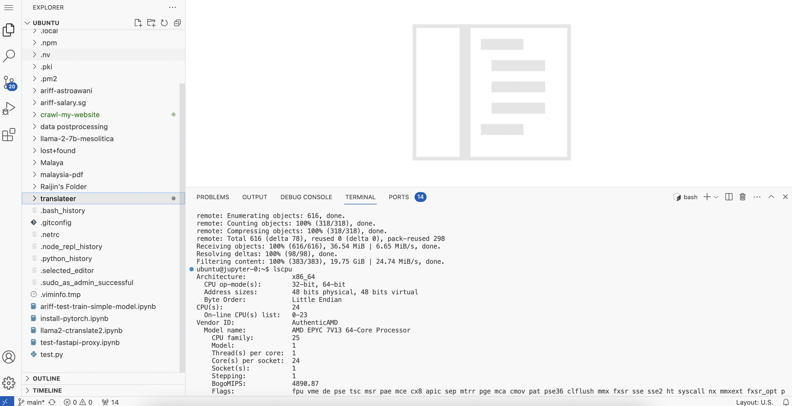
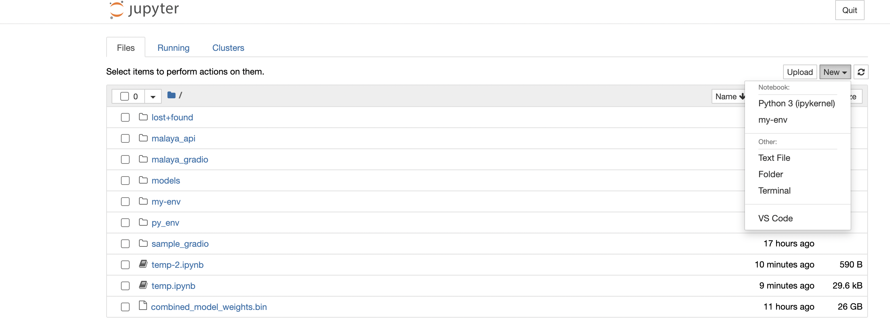

# Jupter Notebook with GPU

Jupyter Notebook with GPU and Code Server!

## Cloud environment

Current manifests only applicable for Azure Kubernetes.

## Server access

protected using Github Oauth, private message @aisyahrzk, or @KamarulAdha or @Hazqeel09 to get access, they will do some background checking.

### Training server 

At https://jupyter.app.mesolitica.com, this server is to train the models and dataset preprocessing.

1. 24 cores.
2. 220 GB RAM.
3. A100 GPU 80GB VRAM.
4. Spot based.

**We also have 4 A100s and 8 A100s GPU servers on idle**.

### Serve server

At https://jupyter-serve.app.mesolitica.com, this server is to serve the model using API and Chatbot interface.

1. 4 cores.
2. 24 GB RAM.
3. T4 GPU 16GB VRAM.
4. Spot based.

## Auto restart script

Because the instance is spot based, so it can be killed any time in 24 hours max span, so we have to prepare the script to auto respawn,

```bash
pm2 start "python3 /dir/script.py"
pm2 save
```

## Jupyter proxy

If you run any webserver inside jupyter server,

```python
from fastapi import FastAPI

app = FastAPI()

@app.get('/')
async def get():
    return 'hello'

import asyncio
import uvicorn

if __name__ == "__main__":
    config = uvicorn.Config(app)
    server = uvicorn.Server(config)
    await server.serve()
```

You can access the webserver at https://jupyter.app.mesolitica.com/proxy/{port}/

## VS code

Go to https://jupyter.app.mesolitica.com/vscode/



## How to create virtual environment

1. Open new terminal using Jupyter Terminal or VS Code.
2. Run these commands,

```bash
sudo apt install python3.10-venv -y
python3 -m venv my-env
~/my-env/bin/pip3 install wheel
~/my-env/bin/pip3 install ipykernel
~/my-env/bin/python3 -m ipykernel install --user --name=my-env
```

3. Feel free to change `my-env` to any name.
4. Go to Jupyter again, you should see your new virtual env,



5. To install libraries,

```bash
~/my-env/bin/pip3 install library
```

In terminal or jupyter cell.

## Rules

1. Respect each others, do not kill someone else processes.
2. Do not abuse for personal gains, eg, mining something.