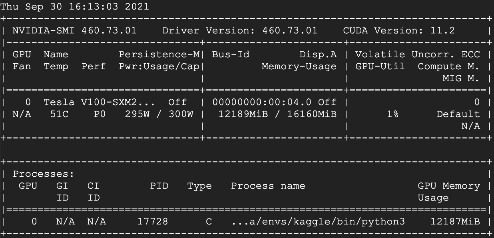

# Jupyterhub
Jupyterhub with GPU. If you part of the organization, you can access to jupyterhub! https://jupyterhub.malaysiaai.ml



## Rules

1. Directory home in Jupyter Notebook is shared among users.
2. Make sure naming your directory properly.
3. Do not try to delete other users data.
4. Notebooks automatically shutdown if idle more than 5 minutes.
5. Admin can kill any GPU usage app anytime.

## how-to

1. Install Jupyter Notebook,

```bash
sudo apt update
sudo apt install python3-dev python3-pip
screen -m ~/.local/bin/jupyter notebook --NotebookApp.token='' --NotebookApp.MappingKernelManager.cull_idle_timeout=300 --ip=0.0.0.0
```
