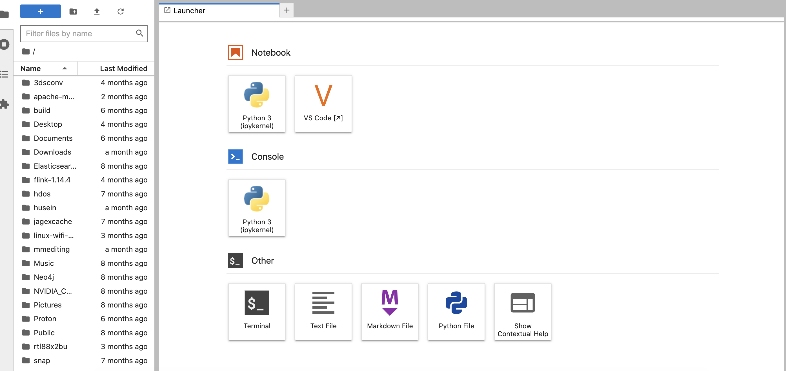
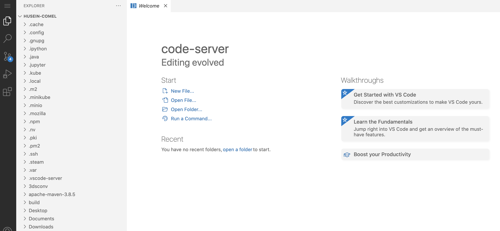

# Jupyterhub + Code-server

Bare metal Jupyterhub with GPU and code-server!

## Request access

1. Install tailscale VPN, https://tailscale.com/
2. Request access https://github.com/malaysia-ai/jupyter-gpu/issues/new?assignees=aisyahrzk%2C+KamarulAdha&labels=on-prem&projects=&template=request-on-prem-access.md&title=
3. Access jupyterhub at http://100.93.25.29:8010/hub/login, admin will give you VPN link and initial password, after login, make sure change your password using `passwd` inside terminal.

## Rules

1. Notebooks automatically shutdown if idle more than 120 minutes.
2. Admin can kill any GPU usage app anytime.
3. Admin also can access your directory anytime.

## how-to install

**Make sure the server already disabled ssh password mode**.

1. Install JupyterHub and Code-server,

```bash
bash install.sh
```

## Access Jupyterlab

Just go to /user/{username}/lab



## Access code-server

Just go to /user/{username}/code-server



## new Kernel

Let say you want to have your own virtualenv want to deploy it as jupyter kernel, follow simple step below,

1. Initialize virtual env,

```bash
python3 -m venv tf-nvidia
```

2. Add in jupyter notebook kernel,

```bash
~/tf-nvidia/bin/pip3 install ipykernel
~/tf-nvidia/bin/python3 -m ipykernel install --user --name=tf1
```

You will found your new kernel in Jupyter Notebook as `tf1`.

## Can I ssh?

Yes you can, 

1. put your public key inside `~/.ssh/authorized_keys`.
2. SSH into it,

```bash
ssh username@100.93.25.29
```

3. After that, you can use VSCode SSH.