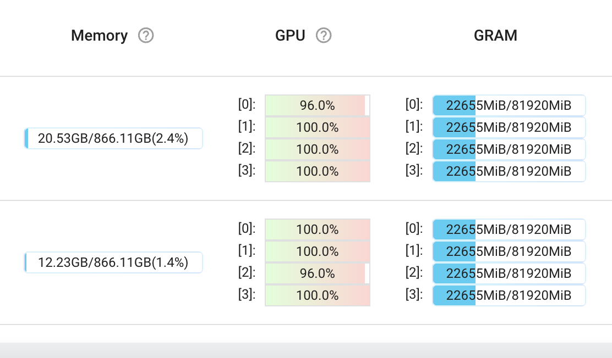

# Training with Ray

The point of this README, is to prep developers to train multinodes on SPOT instances.

## Why Spot?

On-demand GPUs are expensive, with this step, you can train LLM < 13B parameters with less than 10k USD.

## Prerequisite

### ReadWriteMany disk

#### AKS

Right now we use AKS, adding ReadWriteMany is very easy,

- [../aks/storageclass.yaml](../aks/storageclass.yaml)
- [../aks/sharedisk.yaml](../aks/sharedisk.yaml)

After that you can attach disk to existing stateful, https://github.com/malaysia-ai/jupyter-gpu/blob/main/aks/jupyter-us-west2.yaml#L66

#### GKE

For GKE, you need to deploy NFS server. Previous experience I follow https://8grams.medium.com/how-to-setup-persistent-storage-with-nfs-on-gke-google-kubernetes-engine-the-proper-way-daf40b63c149

#### EKS

For EKS, you can follow this tutorial https://aws.amazon.com/blogs/storage/persistent-storage-for-kubernetes/, but you need to attach EFS IAM first.

## What do we learned?

### Where are the notebooks?

All these notebooks been battle-tested.

1. [train-gpt2-mosaic.ipynb](train-gpt2-mosaic.ipynb), 2 nodes, trained GPT2, each node is 1x A100 GPU.

- tested to save the checkpoints and prune old checkpoints.
- tested to load the checkpoint.
- tested random crashed on workers.
- tested random crashed on master.

2. [multigpus-multinodes.ipynb](multigpus-multinodes.ipynb), 2 nodes, each node is 4x A100 GPUs.

- tested to save the checkpoints and prune old checkpoints.
- tested to load the checkpoint.
- tested random crashed on workers.
- tested random crashed on master.

### Ray storage is not straight forward as I think

If you used to HuggingFace Trainer interface, loading checkpoint is very easy, I mean, it just checkpoints, but in Ray, even you setup distributed storage, loading checkpoint is straight hard for HuggingFace, https://docs.ray.io/en/latest/train/user-guides/checkpoints.html#train-distributed-checkpointing

So to solve this problem, we use ReadWriteMany disk, so all locals can access the same directory.

### HuggingFace datasets super slow on huge dataset

We are talking about 100GB+ text files, the problem with HuggingFace datasets, it stream memory mapped file and after that concat, https://github.com/huggingface/datasets/blob/60bdf3005d1dc0b26da8e5949721b20d932eaad6/src/datasets/table.py#L51, super super slow.

You might read https://github.com/huggingface/datasets/issues/2252#issuecomment-846004656, `load_from_disk` can solve the problem, but the problem with this method, it will download entire partitions into each locals.

We cannot use iterator dataset, to resume last steps is not possible due to behavior of iterator (no dataset length).

So to solve this, we use MosaicML streaming, but not straight forward as that. Read more at https://github.com/malaysia-ai/dedup-text-dataset/tree/main/pretrain-llm

### MosaicML streaming is weird

There are locks mechanism happened on first iteration, but, by doing this,

```python
# https://github.com/mosaicml/streaming/issues/307#issuecomment-1729829065
def inf_loop_dataloader(dataloader: torch.utils.data.DataLoader):
    while True:
        for batch in dataloader:
            yield batch
dataloader = DataLoader(train_dataset, batch_size=2)
dataset_iterator = iter(inf_loop_dataloader(dataloader))
batch = next(iter(dataset_iterator))
```

Solved the problem.

### 1 GPU == 1 worker

To utilize all GPUs available, you must set worker size == number of gpus. If you have 2 nodes, each node got 4 GPUs, so the number of workers is 8.

### RuntimeError: Expected all tensors to be on the same device, but found at least two devices

This is because accelerate mismatched the device visibility, so we solved this with very simple patch.

Check the git commit, https://github.com/malaysia-ai/transformers/commit/e794780c91de6453d04ac28b91aacca2bcbbb18b

Why no PR? we are too tired 🤗🤗🤗🤗.

We also added a lot of `print` statements during the debug and lazy to remove it back,

```text
0|bash run-5b  | (RayTrainWorker pid=6522) accelerator.backward after
0|bash run-5b  | (RayTrainWorker pid=6522) loss3 tensor(7.8328, device='cuda:3', grad_fn=<PreBackwardFunctionBackward>)
0|bash run-5b  | (RayTrainWorker pid=6522) model zero grad
0|bash run-5b  | (RayTrainWorker pid=269, ip=10.244.1.6) accelerator.backward after
0|bash run-5b  | (RayTrainWorker pid=269, ip=10.244.1.6) loss3 tensor(7.7416, device='cuda:2', grad_fn=<PreBackwardFunctionBackward>)
0|bash run-5b  | (RayTrainWorker pid=269, ip=10.244.1.6) model zero grad
0|bash run-5b  | (RayTrainWorker pid=6521) accelerator.backward after
0|bash run-5b  | (RayTrainWorker pid=6521) loss3 tensor(7.8758, device='cuda:0', grad_fn=<PreBackwardFunctionBackward>)
0|bash run-5b  | (RayTrainWorker pid=6521) model zero grad
```

### Total step is not correct

Based on total length we have,

```python
dataset = StreamingDataset(local='combine-all')
len(dataset)
# 22116015
```

But during running the script,

```text
"""
***** Running training *****
0|run-3b  | (RayTrainWorker pid=18191, ip=10.224.0.201)   Num examples = 1,105,801
0|run-3b  | (RayTrainWorker pid=18191, ip=10.224.0.201)   Num Epochs = 10
0|run-3b  | (RayTrainWorker pid=18191, ip=10.224.0.201)   Instantaneous batch size per device = 24
0|run-3b  | (RayTrainWorker pid=18191, ip=10.224.0.201)   Total train batch size (w. parallel, distributed & accumulation) = 480
0|run-3b  | (RayTrainWorker pid=18191, ip=10.224.0.201)   Gradient Accumulation steps = 1
0|run-3b  | (RayTrainWorker pid=18191, ip=10.224.0.201)   Total optimization steps = 23,040
0|run-3b  | (RayTrainWorker pid=18191, ip=10.224.0.201)   Number of trainable parameters = 3,027,113,600
0|run-3b  | (RayTrainWorker pid=20644, ip=10.224.0.175)   Continuing training from checkpoint, will skip to saved global_step
0|run-3b  | (RayTrainWorker pid=20644, ip=10.224.0.175)   Continuing training from epoch 0
0|run-3b  | (RayTrainWorker pid=20644, ip=10.224.0.175)   Continuing training from global step 350
0|run-3b  | (RayTrainWorker pid=20644, ip=10.224.0.175)   Will skip the first 0 epochs then the first 350 batches in the first epoch.
"""
```

We got `Num examples = 1,105,801`, this because Mosaic divide by the number of world, https://github.com/mosaicml/streaming/blob/main/streaming/base/dataset.py#L501, which is not correct if you are using HuggingFace Trainer, trainer wrapper already did everything for you including the dataset partition, if you partitioned before enter the trainer, the size of dataset will become wrong, so to solve this problem, we have to use https://docs.mosaicml.com/projects/streaming/en/latest/api_reference/generated/streaming.LocalDataset.html#streaming.LocalDataset

### no GPUs found!

If you get something like this,

```text
RuntimeError: ProcessGroupNCCL is only supported with GPUs, no GPUs found!
```

This can be 2 issues,
1. `nvidia-device-plugin-daemonset` issue.
2. hardware failure.

Most of the time, restarting `nvidia-device-plugin-daemonset` for particular node solved the problem, if the problem still persist, you have to delete the node and pray cloud provider give you a new node,

```bash
kubectl cordon node
kubectl drain node
kubectl delete node node
```

## What if

### Worker died

If you set,

```python
run_config = train.RunConfig(failure_config=train.FailureConfig(max_failures=-1))
ray_trainer = TorchTrainer(
    train_func,
    scaling_config=scaling_config,
    run_config=run_config

)
```

Everything should be ok, the master just wait the worker come back.

### Master died

```text
RayActorError: The actor died unexpectedly before finishing this task.
	class_name: _QueueActor
	actor_id: 317b9ec747c7ca69b0d3016905000000
	pid: 12433
	namespace: 156b8ae5-a686-44c3-a310-a0d4e01f3334
	ip: 10.208.0.212
The actor is dead because its owner has died. Owner Id: 05000000ffffffffffffffffffffffffffffffffffffffffffffffff Owner Ip address: 10.208.0.212 Owner worker exit type: SYSTEM_ERROR Worker exit detail: Owner's node has crashed.
```

The script totally dead, to solve this problem, we can use context manager and infinite loop,

```python
import time

class RayConnection:
    def __init__(self, address, **kwargs):
        ray.init(address=address, **kwargs)

    def __enter__(self):
        return self

    def __exit__(self, typ, value, traceback):
        ray.shutdown()


while True:
    with RayConnection("ray://ray-master:10001", runtime_env=runtime_env):
        scaling_config = ScalingConfig(num_workers=2, use_gpu=True)
        run_config = train.RunConfig(failure_config=train.FailureConfig(max_failures=-1))
        ray_trainer = TorchTrainer(
            train_func,
            train_loop_config={
                'local': 'local_dir',
                'remote': 's3://train/indexed'
            },
            scaling_config=scaling_config,
            run_config=run_config

        )
        result = ray_trainer.fit()
    
    print('ray cluster disconnected, time to sleep.')
    time.sleep(10)
```

But, training script will be inside ray master, so if master died, script died too.

## Dry run

To dry run,

```bash
python3 train.py \
--model_name_or_path huseinzol05/dummy-mistral-1.1b \
--storage_directory "/home/ubuntu" \
--share_directory "/home/ubuntu/share" \
--torch_dtype "bfloat16" \
--train_file "/home/ubuntu/share/combine-all" \
--block_size 4096 \
--num_workers 20
```

```
 23%|██▎       | 5/22 [00:42<02:21,  8.35s/it]
(RayTrainWorker pid=20282, ip=10.224.0.177) {'loss': 8.4434, 'learning_rate': 8.228161798644421e-05, 'epoch': 0.45}
 23%|██▎       | 5/22 [00:43<02:24,  8.48s/it]
(RayTrainWorker pid=20282, ip=10.224.0.177) {'loss': 8.3139, 'learning_rate': 9.160270615698787e-05, 'epoch': 0.55}
 27%|██▋       | 6/22 [00:51<02:12,  8.28s/it]
 27%|██▋       | 6/22 [00:50<02:11,  8.19s/it]
(RayTrainWorker pid=56577) {'loss': 8.3139, 'learning_rate': 9.160270615698787e-05, 'epoch': 0.55}
(RayTrainWorker pid=20282, ip=10.224.0.177) {'loss': 7.9451, 'learning_rate': 9.948357391330555e-05, 'epoch': 0.64}
 32%|███▏      | 7/22 [00:59<02:01,  8.09s/it]
 32%|███▏      | 7/22 [00:57<02:00,  8.03s/it]
(RayTrainWorker pid=56577) {'loss': 7.9451, 'learning_rate': 9.948357391330555e-05, 'epoch': 0.64}
```



- tested to save the checkpoints and prune old checkpoints.
- tested to load the checkpoint.

https://wandb.ai/mesolitica/run-ray?workspace=user-husein-mesolitica

**This script already hardcoded deepspeed Zero 3 config and other configs, it might only suitable to pretrain mistral from scratch**.

## Building image

```bash
docker build -t malaysiaai/ray-gpu-devel:main .
docker push malaysiaai/ray-gpu-devel:main
```